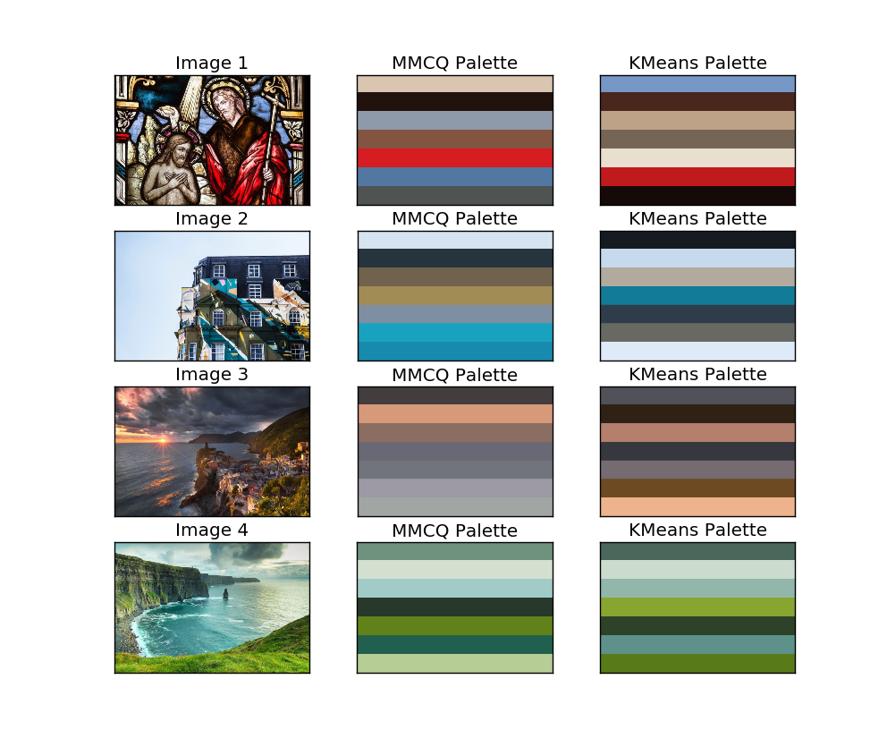

ImageColorTheme
---

[Extract Color Themes from Images](http://blog.rainy.im/2015/11/25/extract-color-themes-from-images/)

### `pixData`

```py
import numpy as np

pixData = np.array([[R, G, B], [R, G, B],...], dtype=np.uint8)
print(pixData.shape)
# (h, w, d)
```

### MMCQ

```py
from ict.MMCQ import MMCQ
mmcq = MMCQ(pixData, maxColor)
theme= mmcq.quantize()
```

### k-means

```py
from ict.KMeans import KMeans
km = KMeans(pixData, maxColor)
theme = km.quantize()
```

### Results


